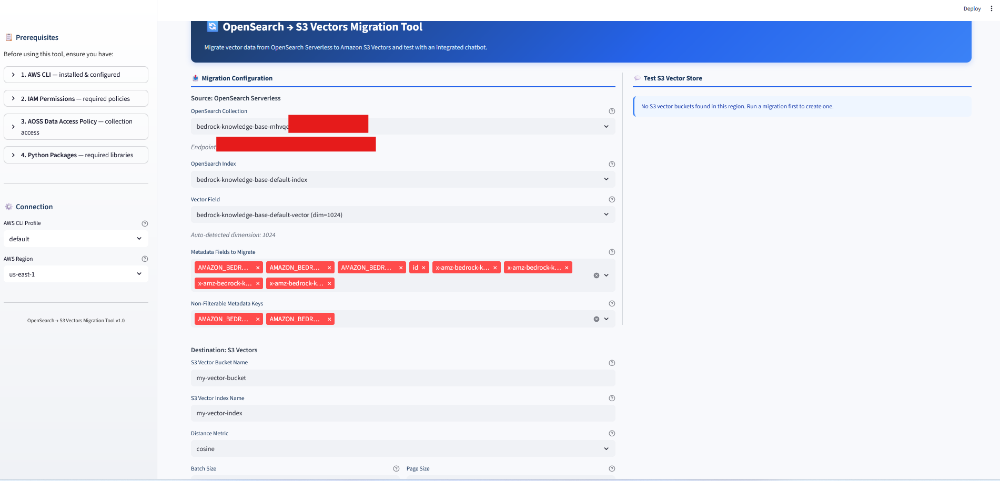

# OpenSearch Serverless → S3 Vectors Migration Tool

A Streamlit web app that migrates vector data from Amazon OpenSearch Serverless (AOSS) to Amazon S3 Vectors, with an integrated chatbot to test the migrated data.



## Features

- Auto-discovers AOSS collections, indexes, and field mappings from your AWS CLI profile
- Auto-detects vector dimensions and metadata fields from the index mapping
- Creates S3 vector buckets and indexes with configurable distance metrics and non-filterable metadata keys
- Streams vectors from OpenSearch to S3 Vectors using `search_after` pagination (Scroll API is not supported on AOSS)
- Batched `PutVectors` calls with throttle retry handling
- Built-in chatbot panel to query the migrated S3 Vectors index using Titan Embeddings V2 + Claude on Bedrock
- Fragment-based chatbot UI — chat queries don't reload the migration panel

## Prerequisites

1. **AWS CLI** installed and configured with at least one named profile (`aws configure`)
2. **IAM permissions** for OpenSearch Serverless (`aoss:ListCollections`, `aoss:BatchGetCollection`, `aoss:APIAccessAll`), S3 Vectors (`s3vectors:CreateVectorBucket`, `CreateIndex`, `PutVectors`, `QueryVectors`, and list/get actions), and `bedrock:InvokeModel` — scoped to your specific collection and vector bucket rather than `*`. See the in-app **IAM Permissions** panel for a ready-to-use least-privilege policy.
3. **AOSS Data Access Policy** granting your IAM principal `aoss:DescribeIndex` and `aoss:ReadDocument` on the source collection
4. **Python packages:**
   ```
   pip install streamlit boto3 opensearch-py requests-aws4auth
   ```

## Usage

```
streamlit run app.py
```

The app provides a full UI with:
- Cascading dropdowns for collection → index → vector field selection
- Metadata field picker with non-filterable key configuration
- S3 Vectors destination settings (bucket, index, distance metric, batch size)
- Migration progress bar with success/failure reporting
- Chatbot panel to semantically search the migrated vector store

## Key Technical Details

- **AOSS does not support the Scroll API.** The tool uses `search_after` with `_id` sort for deep pagination.
- **AOSS uses IAM SigV4 auth**, not username/password. The app uses `AWSV4SignerAuth` from `opensearch-py`.
- **S3 Vectors `PutVectors`** supports max 500 vectors per batch, 1,000 requests/sec, 2,500 vectors/sec per index.
- **Metadata types:** S3 Vectors supports string, number, and boolean only. Nested objects are serialized to JSON strings.
- **Filterable metadata** is limited to 2 KB per vector. Large text fields (like text chunks) should be configured as non-filterable keys (up to 40 KB total).
- **Vector dimensions** must be 1–4,096 (float32 only). The app auto-detects this from the OpenSearch index mapping.
- The chatbot LLM is configurable in the sidebar and defaults to the Claude Sonnet 4.5 cross-Region inference profile (`us.anthropic.claude-sonnet-4-5-20250929-v1:0`). Current Claude models must be invoked via an inference profile ID (prefixed `us.`, `eu.`, etc.), not the raw foundation-model ID, and must be enabled under Bedrock → Model access.

## References

- [S3 Vectors User Guide](https://docs.aws.amazon.com/AmazonS3/latest/userguide/s3-vectors.html)
- [S3 Vectors Best Practices](https://docs.aws.amazon.com/AmazonS3/latest/userguide/s3-vectors-best-practices.html)
- [S3 Vectors Limitations](https://docs.aws.amazon.com/AmazonS3/latest/userguide/s3-vectors-limitations.html)
- [AOSS Supported Operations](https://docs.aws.amazon.com/opensearch-service/latest/developerguide/serverless-genref.html)
- [AOSS Data Access Policies](https://docs.aws.amazon.com/opensearch-service/latest/developerguide/serverless-data-access.html)

## Security

See [CONTRIBUTING](CONTRIBUTING.md#security-issue-notifications) for more information.

## License

This library is licensed under the MIT-0 License. See the LICENSE file.
